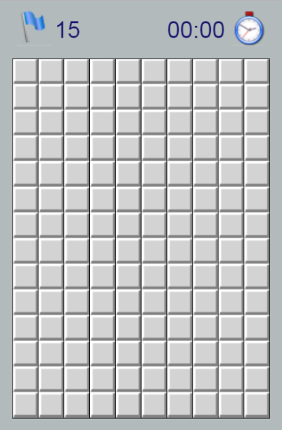

# Sapper
Sapper (Miner) is a logic 2d game

 
## Description
The objective of the game is to clear a board containing hidden mines without detonating any of them, 
using the numerical hints indicating the number of mines in neighboring cells. 
The first opened cell cannot contain a bomb.

You can mark cells containing mines by flags. If the number on hint, match the number of flagged neighboring cells. 
You can open the rest of closed neighboring cells using simultaneously click of two mouse buttons on the hint.

 
Game is over if you open mined cell. When all not mined cells are opened, you won. 
Timer will be stopped showing the time spent on this attempt and you can try to solve the puzzle faster next time. 

